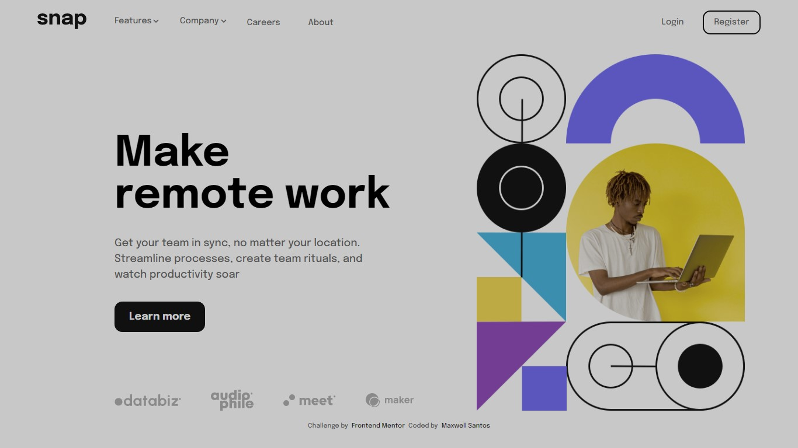
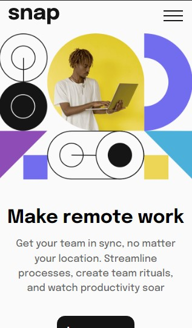

# Apresentation Page

## Table of contents

- [Overview](#overview)
  - [Screenshot](#screenshot)
  - [Links](#links)
- [My process](#my-process)
  - [Built with](#built-with)
  - [What I learned](#what-i-learned)
- [Author](#author)
- [Obs](#observação)

## Overview

### Screenshot



### Links

- Solution URL: [Solution](https://your-solution-url.com)
- Live Site URL: [Site online](https://apresentationPage.vercel.app)

## My process

### Built with

- Semantic HTML5 markup
- CSS custom properties
- CSS Modules
- CSS Variables
- Flexbox

### What I learned

### Javascript na responsividade

<p>Para manipular o estilo da página, deixá-la responsiva, geralmente usamos as <a href="https://developer.mozilla.org/pt-BR/docs/Web/CSS/Media_Queries/Using_media_queries">Media Queries</a> do css, onde se difine os breakpoints do tamanho da tela para adaptar como os itens vão ficar distribuídos na tela</p>

<p>Porém meu problema foi além de trocar estilo, e sim conteúdo de tags, no caso o <code>src</code> da tag <code>img</code> do html, logo precisei do javascript para fazer isso:</p>

```js
let targetWindow = window.screen.width; //nessa variável, ta sendo armazenado o valor da largura da tela (number)

const img = document.querySelector('.hero-content img') //selecionei a img dentro de .hero-content, porque é ela que vou manipular

if (targetWindow <= 950) { //se a largura da tela for menor ou igual a 950 (como essa variável retorna um number, a operação relacional tem que ser feita com number), o que eu peguei aqui é o 950 pixels da tela

  img.src = './src/images/image-hero-mobile.png' //troca o src da img 

} else {
  //precisei fazer um else, porque quando trocava uma vez, e aumentasse de novo a tela no devtools do chrome, a img mantinha, porém eu quero algo 'dinâmico'
  img.src = './src/images/image-hero-desktop.png' //troca o src da img

}
```
<p>Chega um momento em que a tela está tão pequena, que o <code>header</code> ja não cabe mais, logo preciso dar um jeito de caber na tela</p>

<p>Para isso peguei uma img de menu, famoso hamburguer, e adicionei um evento ao clicar nele</p>

```html
  <div class="menu">
    
  </div>
```

```js
const toggleMenu = document.querySelector('.menu img') //pegando elemento img do html

const aside = document.querySelector('header nav')
const bodyActive = document.querySelector('body') //pegando a tag body
const button = document.querySelector('.learn-more') 

toggleMenu.addEventListener('click', () => { //quando clicar nesse elemento vai executar essa função

  bodyActive.classList.toggle('active') //add a classe 'active' ao body 
  check(aside.classList)

})

```
- Essa função <code>check()</code>, recebe como parâmetro a classe atual do <code>nav</code> e é por ela que vou animar a aparição do menu lateral
- Ao disparar o evento, a <code>class</code> do <code>nav</code> terá uma dessas formas:

<ol>
  <li>class = ''</li>
  <li>class = 'active'</li>
  <li>class = 'noshow'</li>
</ol>

```js
function check(classe) { //cada vez que clicar no menu, vai disparar essa função

  if (classe == '') {
    toggleMenu.src = './src/images/icon-close-menu.svg'
    classe.toggle('active') //adicionando a classe 'active' ao nav, no qual tem um estilo diferente do desktop    
    
    button.style.zIndex = '-1'

  } else if (classe == 'active') {

    classe.remove('active')

    toggleMenu.src = './src/images/icon-menu.svg' //img do menu padrão caso a classe 'active' não existir
    classe.toggle('noshow')

    button.style.zIndex = '1'

  } else if (classe == 'noshow') {

    classe.remove('noshow')

    toggleMenu.src = './src/images/icon-close-menu.svg' //img do menu padrão caso a classe 'active' não existir
    classe.toggle('active')
    
    button.style.zIndex = '-1'

  }
}
```
- Esse estilo que apliquei, foi só para arrumar um erro que estava acontecendo por conta da animação ao entrar no site, a biblioteca <a href='https://greensock.com/gsap/'>Gsap</a> aplica um pré estilo que estava dando conflito

```js
  button.style.zIndex = '1 | -1'
```

- O efeito de vai e vem do menu é basicamente isso:

```css
@keyframes show {
  from {
    width: 0;
    opacity: 0;
  }

  to {
    opacity: 1;

    display: block;
    width: 240px;
  }
}

@keyframes exit{
  from{
    opacity: 1;
    width: 240px;
  }
  to{
    opacity: 1;
    width: 0;

  }
}

header nav.active {
  opacity: 1;
  display: block;
  width: 240px;
  padding: 4rem 1rem 0 1rem;

  animation: show .5s;
}

header nav.noshow{
  display: block;
  padding: 4rem 1rem 0 1rem;

  animation: exit .5s;
}
```

### Active

### !Active



## Author

- Frontend Mentor - [@Maxwell-Santos](https://www.frontendmentor.io/profile/Maxwell-Santos)

### Observação
*Para os curiosos testarem a responsividade no computador, precisa recarregar o site para trocar a img para o mobile*

