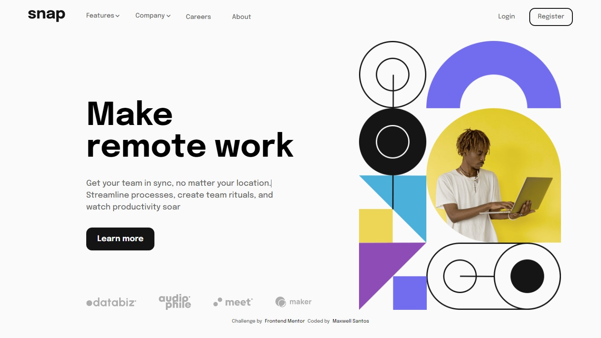

# Apresentation Page

## Table of contents

- [Overview](#overview)
  - [Screenshot](#screenshot)
  - [Links](#links)
- [My process](#my-process)
  - [Built with](#built-with)
  - [What I learned](#what-i-learned)
- [Author](#author)

## Overview

### Screenshot



### Links

- Solution URL: [Solution](https://your-solution-url.com)
- Live Site URL: [Site online](https://apresentationPage.vercel.app)

## My process

### Built with

- Semantic HTML5 markup
- CSS custom properties
- CSS Modules
- CSS Variables
- Flexbox

### What I learned

### Javascript na responsividade

<p>Para manipular o estilo da página, deixá-la responsiva, geralmente usamos as <a href="https://developer.mozilla.org/pt-BR/docs/Web/CSS/Media_Queries/Using_media_queries">Media Queries</a> do css, onde se difine os breakpoints do tamanho da tela para adaptar como os ítens vão ficar distribuídos na tela</p>

<p>Porém meu problema foi além de trocar estilo, e sim conteúdo de tags, no caso o src da tag img do html, logo precisei do javascript para fazer isso:</p>

```js
let targetWindow = window.screen.width; //nessa variável, ta sendo armazenado o valor da largura da tela (number)

const img = document.querySelector('.hero-content img') //selecionei a img dentro de .hero-content, porque é ela que vou manipular

if (targetWindow <= 950) { //se a largura da tela for menor ou igual a 950 (como essa variável retorna um number, a operação relacional tem que ser feita com number), o que eu peguei aqui é o 950 pixels da tela

  img.src = './src/images/image-hero-mobile.png' //troca o src da img 

} else {
  //precisei fazer um else, porque quando trocava uma vez, e aumentasse de novo a tela no devtools do chrome, a img mantinha, porém eu quero algo 'dinâmico'
  img.src = './src/images/image-hero-desktop.png' //troca o src da img

}
```
<p>Chega um momento em que a tela está tão pequena, que o header ja não cabe mais, logo preciso dar um jeito de caber na tela</p>

<p>Para isso peguei uma img de menu, famoso hamburguer, e adicionei um evento ao clicar nele</p>

```html
  <div class="menu">
    
  </div>
```

```js
const toggleMenu = document.querySelector('.menu img') //pegando elemento img do html

const aside = document.querySelector('header nav')
const bodyActive = document.querySelector('body') //pegando a tag body

toggleMenu.addEventListener('click', () => { //quando clicar nesse elemento vai executar essa função

  aside.classList.toggle('active') //adicionando a classe 'active' ao nav, no qual tem um estilo diferente do desktop
  bodyActive.classList.toggle('active') //add a classe 'active' ao body 

  if(aside.classList == 'active'){ //se a classe 'active' existir quando clicar no menu, vai mostrar a img de close
    toggleMenu.src = './src/images/icon-close-menu.svg'

  } else {
    toggleMenu.src = './src/images/icon-menu.svg' //img do menu padrão caso a classe 'active' não existir

  }
  
})

```

```css
/*Active aside*/

body.active {
  overflow-y: hidden;
}
/*ASIDE*/
header nav.active {
  opacity: 1;
  display: block;
  position: absolute;
  right: 0; /*somatórias dos padding do header + o padding do nav*/
  top: 0;

  height: 100vh;
  width: 240px;
  padding: 4rem 1rem 0 1rem;
  flex-direction: column;
  justify-content: flex-start;
  background: var(--almost-white);
}

```
### Active

### !Active


## Author

- Frontend Mentor - [@yourusername](https://www.frontendmentor.io/profile/Maxwell-Santos)


